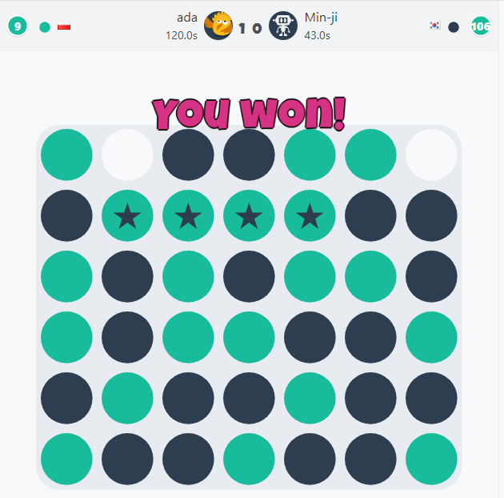
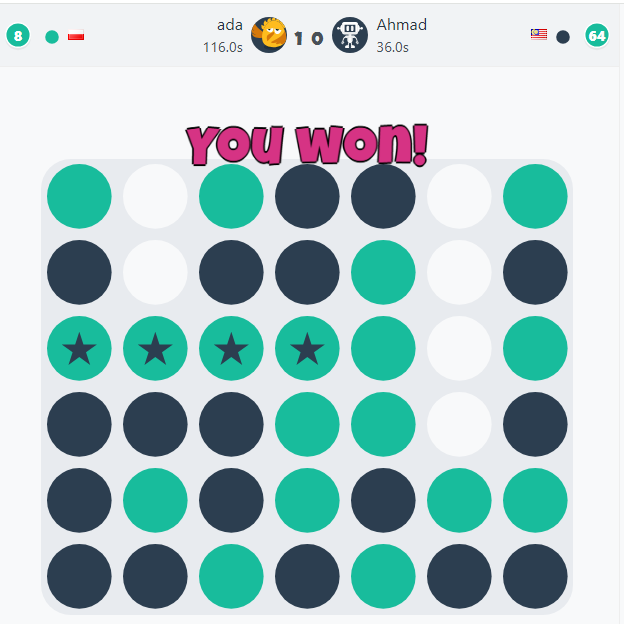
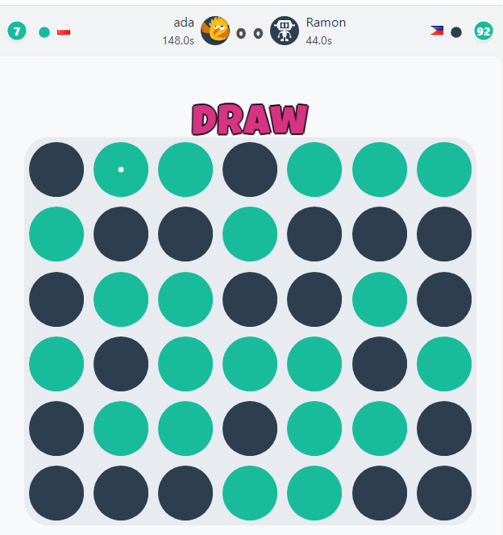
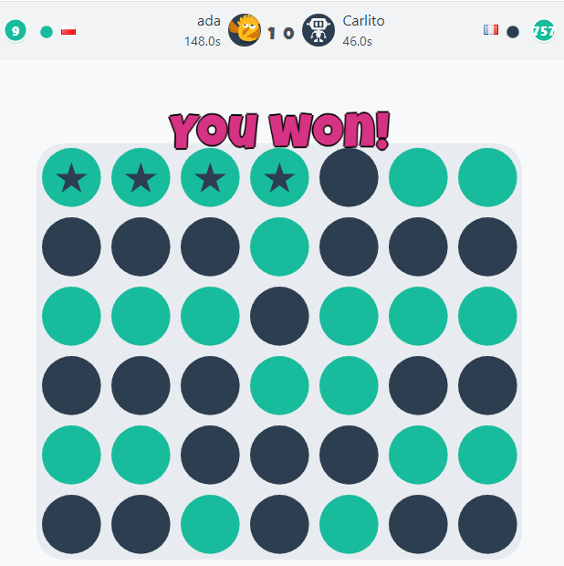

# AlphaZero for Board Games

An implementation of [AlphaZero](https://arxiv.org/abs/1712.01815) (Google DeepMind, 2017) applied to board games — Tic-Tac-Toe, Connect 4, and Santorini.

Originally implemented in **2020**. Restructured and modernized in **2026** (PyTorch migration, unified game interface, KataGo-inspired training improvements).

## Overview

AlphaZero learns to play board games entirely from self-play, with no human knowledge beyond the rules of the game. This project reproduces the core components of that system:

- Monte Carlo Tree Search (MCTS) guided by a neural network
- Dual-head neural network outputting both a move policy and a position value
- Self-play training loop that generates training data from games the agent plays against itself

## Results

The Connect 4 model defeated [Min-ji](https://papergames.io/en/r/SPQKyjKpFH/replay) (2000 Elo), [Ahmad](https://papergames.io/en/r/va-9VWrm3Z/replay) (2025 Elo), and drew against [Ramon](https://papergames.io/en/r/VsRFK9i2Re/replay) (2050 Elo) on PaperGames — all playing as second player on the first attempt with 200 sims/move (Connect 4 favors the first player). Also defeated [Carlito](https://papergames.io/en/r/pnc7H7iCj/replay) (2200 Elo, the strongest bot on the site) with 400 sims/move. Trained on a single GPU in ~1 hour with a lightweight residual network (4 res blocks, 64 filters).

| Min-ji (2000 Elo) — Win | Ahmad (2025 Elo) — Win |
|:-:|:-:|
|  |  |
| **Ramon (2050 Elo) — Draw** | **Carlito (2200 Elo, 400 sims) — Win** |
|  |  |

## Quick Start

**Requirements:** Python 3.8+, [PyTorch](https://pytorch.org/) with CUDA, a C compiler (for Cython extensions), and `triton` for `torch.compile` acceleration (`pip install triton`, or `pip install triton-windows` on Windows).

```bash
pip install -r requirements.txt
python setup.py build_ext --inplace
```

**Play against the AI** (pretrained models included in `checkpoints/`):

```bash
python play.py --game tictactoe --human-first
python play.py --game connect4 --human-first
python play.py --game santorini --human-first
```

**Train from scratch:**

```bash
python -u train.py --game connect4 2>&1 | tee training_log_c4.txt
python -u train.py --game santorini --iterations 128 2>&1 | tee training_log_santorini.txt
```

All training parameters have per-game defaults in `game_configs.py` and can be overridden via CLI:

```bash
python -u train.py --game santorini --iterations 64 --games 64 --simulations 256
```

**Monitor training:**

```bash
tensorboard --logdir runs/
```

## Supported Games

| Game            | Board | Action Space |
| --------------- | ----- | ------------ |
| **Tic-Tac-Toe** | 3x3   | 9            |
| **Connect 4**   | 6x7   | 7            |
| **Santorini**   | 5x5   | 128          |

## Architecture

```
Input (2ch: my pieces, opponent pieces)
        |
  WS-Conv2D + GroupNorm + ReLU
        |
  Pre-activation ResBlock x N (with Weight Standardization)
   +--------+
 Policy    Value
  Head      Head
   |         |
 Conv 1x1  Conv 1x1 + GAP
 GN+ReLU   GN+ReLU
 Linear    FC + Dropout
 Softmax   WDL logits (Win/Draw/Loss)
```

- **Weight Standardization** on all conv layers — normalizes weights per filter, prevents weight explosion in non-stationary RL training
- **Batched parallel self-play** — all games evaluate simultaneously on GPU in a single forward pass

## Training Improvements

Beyond standard AlphaZero, this implementation includes several [KataGo](https://arxiv.org/abs/1902.10565)-inspired improvements to address the self-play data distribution bias:

- **Policy Surprise Weighting** — positions where MCTS disagrees with the network's prior (high KL divergence) are oversampled during training. Ensures the network trains more on positions it gets wrong.

- **Search-Contempt** — at opponent nodes in the MCTS tree, after sufficient visits, switches from PUCT to Thompson sampling. Forces the opponent to occasionally play unexpected moves, diversifying the positions reached during self-play.

- **Policy Target Pruning** — after MCTS, subtracts Dirichlet noise and exploration-induced visits from non-best children before constructing the policy training target. Prevents the network from learning to predict exploration artifacts.

## MCTS

PUCT action selection with Cython-accelerated tree operations:

```
a* = argmax [ Q(s,a) + c_puct * P(s,a) * sqrt(N(s)) / (1 + N(s,a)) ]
```

- Dirichlet noise at root for exploration
- Virtual loss for parallel tree traversal
- Temperature annealing: proportional play early, greedy after `temp_threshold` moves
- Tree reuse between moves

MCTS, Connect 4, and Santorini game logic are all implemented in Cython for performance.

## Tournament

Battle all saved checkpoints in a single-elimination tournament:

```bash
python battle/tournament.py --game connect4 --sims 50 --games 50 --parallel 50
```

Loads all `.pt` checkpoints from `checkpoints/<game>/`, pairs them chronologically, and plays elimination matches. Each match alternates who goes first.

## References

- Silver, D., et al. (2017). _Mastering Chess and Shogi by Self-Play with a General Reinforcement Learning Algorithm_. [arXiv:1712.01815](https://arxiv.org/abs/1712.01815)
- Silver, D., et al. (2017). _Mastering the game of Go without human knowledge_. Nature, 550, 354-359.
- Wu, D. J. (2019). _Accelerating Self-Play Learning in Go_. [arXiv:1902.10565](https://arxiv.org/abs/1902.10565)
- KataGo methods and training improvements: [github.com/lightvector/KataGo/blob/master/docs/KataGoMethods.md](https://github.com/lightvector/KataGo/blob/master/docs/KataGoMethods.md)
- Löwisch, M. & Wiering, M. (2020). _Reducing the Variance of AlphaZero_. Adaptive and Learning Agents Workshop (ALA), AAMAS 2020.
